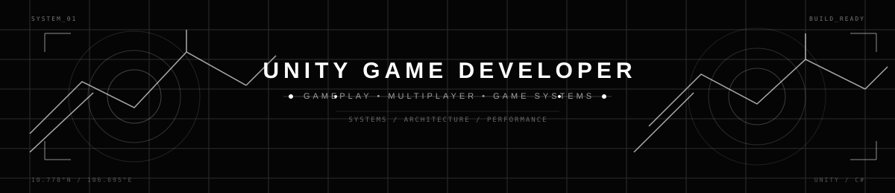

  
  
  
  

---

## About Me

Hi, I'm **Danh**, a final-year IT student and Unity developer based in Ho Chi Minh City, Vietnam.

I enjoy turning game ideas into playable systems, especially gameplay mechanics, multiplayer features, AI behavior, and platform-ready builds. My current goal is to grow as a Unity developer and help ship polished PC and mobile games.

- Building Unity gameplay systems and multiplayer prototypes
- Learning scalable game architecture, profiling, and optimization
- Looking for Unity Fresher / Part-time opportunities
- Interested in creative games with strong atmosphere and player interaction

---

## Tech Constellation

### Core Game Development

  
  
  
  

`Gameplay Programming` · `UI Canvas` · `Input System` · `Physics & Collision`

`Animator` · `Scene Management` · `Coroutines` · `REST API Integration`

### Architecture & Optimization

  
  
  
  

`ScriptableObject` · `Object Pooling` · `FSM` · `Behavior Tree`

`Event-driven Systems` · `Save & Load` · `Memory Management` · `Debugging`

### Tools & Additional Development

  
  
  
  
  
  

`PHP` · `JavaScript` · `HTML5` · `CSS3` · `MySQL` · `REST API`

---

## Featured Missions

| Project | Highlights | Stack |
| --- | --- | --- |
| **Nightmare** | Solo-developed first-person 3D game with interaction, scene transitions, and event-driven gameplay. [Watch demo](https://www.youtube.com/watch?v=x2lgb0dQqJA) · [Play on itch.io](https://dankchan.itch.io/nightmare) | Unity, C# |
| **Midnight** | Room creation/joining, synchronized players, real-time chat, spatial voice, touch controls, and mobile camera systems. [Watch demo](https://www.youtube.com/watch?v=DQCeELvtVCk) | Unity, C#, Photon PUN 2, Photon Voice |
| **Gemzy** | Pixel-art Match-3 game with an 8×8 board, combo system, animated gems, particle effects, touch/mouse controls, and mobile-friendly UI. [Watch demo](https://www.youtube.com/shorts/WEhOnYjLyiA) · [View on GitHub](https://github.com/Danhtran07/Gemzy) | Unity, C#|

---

## Current Coordinates

- Unity gameplay systems
- Multiplayer architecture
- Performance profiling and optimization
- Design patterns for reusable game features
- Cross-platform build workflows

---

### Building Games · Exploring Systems · Growing Every Day

<a href="mailto:tdanh589@gmail.com">Email</a>
·
<a href="https://github.com/Danhtran07">GitHub</a>
·
<a href="https://www.linkedin.com/in/danh-tran-82a037300/">LinkedIn</a>

 

Made with care somewhere between code and the cosmos.

